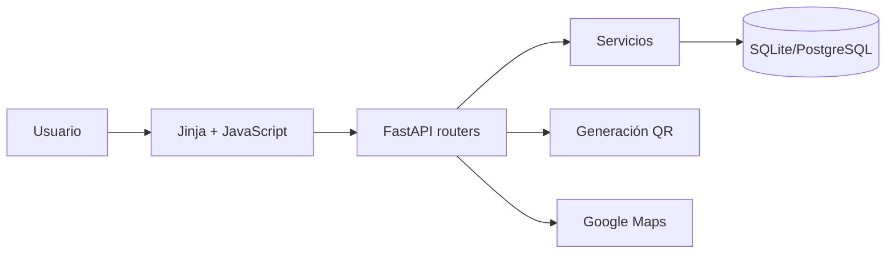
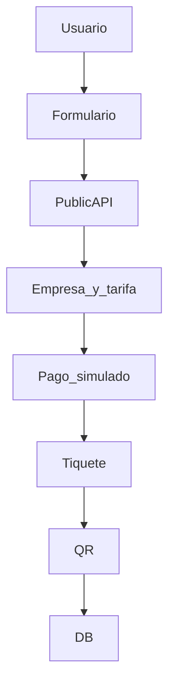
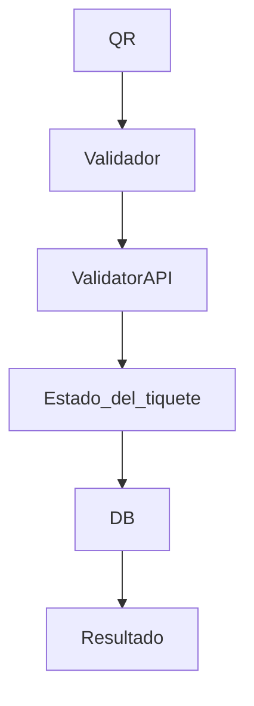
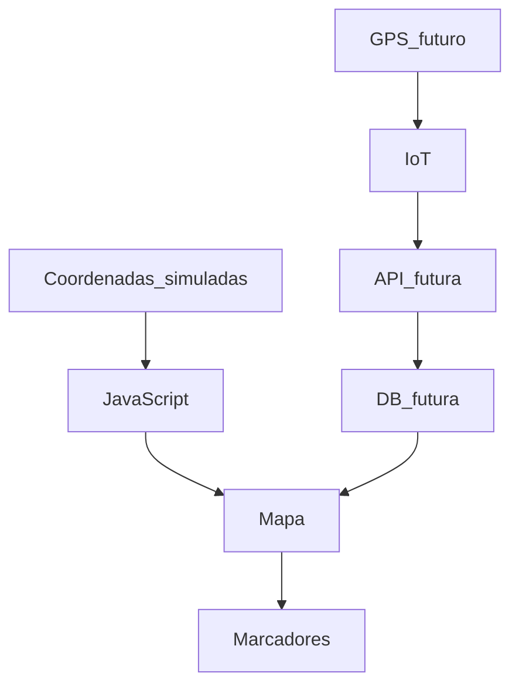

# Arquitectura

## Compra

## Validación

## Rastreo

El rastreo actual es una simulación; una fuente GPS futura debe reemplazar `services/tracking.py` por una API autenticada que persista posiciones.
